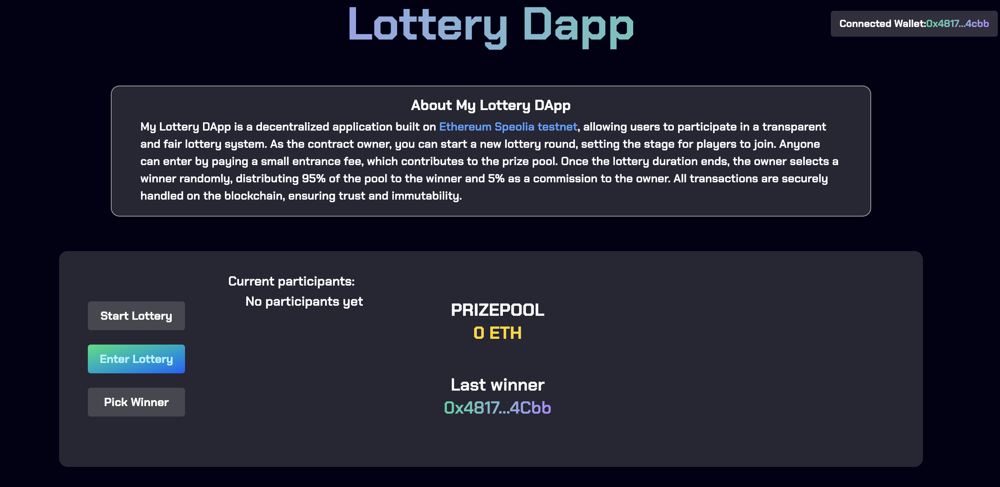

# Lottery DApp

A decentralized lottery application built on Ethereum using Solidity smart contracts and a React frontend. The smart contract allows an owner to start a lottery, users to enter by paying an entrance fee, and the owner to pick a winner after a set interval, distributing 95% of the prize pool to the winner and 5% as a commission. The React frontend provides a user-friendly interface to connect a wallet, view the prize pool, participants, and last winner, and interact with the lottery (start, enter, or pick winner).



## Table of Contents

- [Overview](#overview)
- [Features](#features)
- [Tech Stack](#tech-stack)
- [Prerequisites](#prerequisites)
- [Installation](#installation)
- [Usage](#usage)
- [Contributing](#contributing)
- [License](#license)

## Overview

The Lottery DApp is deployed on the Sepolia testnet and enables a transparent, blockchain-based lottery system. The smart contract, written in Solidity, manages the lottery logic, including participant entry, prize pool accumulation, and winner selection. The React frontend, integrated with Web3.js, allows users to connect their MetaMask wallet, view real-time lottery data (e.g., prize pool, participants), and perform actions like entering the lottery or starting a new round (for the owner).

## Features

- **Owner-Controlled Lottery**: The contract owner can start a new lottery round and pick a winner after the specified interval.
- **Participant Entry**: Users can enter the lottery by paying a fixed entrance fee (e.g., 0.001 ETH), contributing to the prize pool.
- **Prize Distribution**: After the lottery ends, 95% of the prize pool is sent to the winner, and 5% is sent to the owner as a commission.
- **Random Winner Selection**: Uses `keccak256` for randomness (with plans to integrate Chainlink VRF in the future).
- **Real-Time Frontend**: Displays the current prize pool, list of participants, and last winner, with a responsive UI styled using Tailwind CSS.
- **Wallet Integration**: Supports MetaMask for wallet connection and transaction signing.
- **Event Monitoring**: The frontend subscribes to contract events (`Enter_lottery`, `Picked_winner`, `Lottery_starts`) for real-time updates.

## Tech Stack

- **Smart Contract**:
  - Solidity ^0.8.0
  - Foundry (Forge for compilation, testing, and deployment)
  - Libraries: None explicitly imported (e.g. Forge-std)
- **Frontend**:
  - React.js
  - Web3.js (for Ethereum interaction)
  - Tailwind CSS (for styling)
- **Blockchain**:
  - Ethereum Sepolia testnet
  - MetaMask (for wallet interaction)
- **Development Tools**:
  - Node.js (for frontend development)
  - Foundry’s Anvil (for local blockchain testing)

## Prerequisites

- **Node.js** (v16 or later)
- **Foundry** (latest version)
- **MetaMask** browser extension
- **Ethereum Sepolia testnet** RPC URL (e.g., via Infura or Alchemy)
- **Sepolia ETH** for testing (available from faucets like [Sepolia Faucet](https://sepoliafaucet.com/))

## Installation

### 1. Clone the Repository

```bash
git clone https://github.com/dinomartino/Project-II-Lottery
cd Project-II-Lottery
```

### 2. Set Up Smart Contract

Navigate to the Solidity/ directory

Install Foundry:
If not already installed, run:

```bash
curl -L https://foundry.paradigm.xyz | bash
foundryup
```

Install Dependencies:
Ensure Foundry dependencies are installed:

```bash
forge install foundry-rs/forge-std
```

### 3. Set Up Frontend

Navigate to the lottery-front/ directory:

```bash
cd lottery-front
npm install
```

### 4. Configure Environment Variables

- **Smart Contract** (create `.env` in the root directory):
  ```env
  PRIVATE_KEY=your-private-key
  RPC_URL=https://sepolia.drpc.org
  ```

## Usage

### 1. Run a Local Blockchain

Start a local Foundry Anvil node:

```bash
anvil
```

### 2. Compile and Deploy Smart Contract

Compile the contract:

```bash
forge build
```

Deploy the contract to the local network:

```bash
forge script script/Deployment.s.sol --rpc-url http://localhost:8545 --private-key your-private-key --broadcast
```

Update `lottery-front/src/contractInfo.js` with the deployed contract address and ABI.

### 3. Start the Frontend

In the `/lottery-front` directory:

```bash
npm run dev
```

Open `http://localhost:3000` in your browser, connect MetaMask to the local network (or Sepolia), and interact with the dApp:

- **Owner**: Click “Start Lottery” to begin a new round or “Pick Winner” after the interval.
- **Participants**: Click “Enter Lottery” to join by paying the entrance fee (0.001 ETH).
- View the prize pool, participants, and last winner in real-time.

## Testing

### Smart Contract Tests

Run Foundry tests (create tests in `test/` directory, e.g., `test/Lottery.t.sol`):

```bash
forge test -vvv
```

## Deployment

### Deploy Smart Contract

To deploy to Sepolia:

```bash
forge script script/Deploy.s.sol --rpc-url $RPC_URL --private-key $PRIVATE_KEY --broadcast
```

The contract is already deployed at [0x7D2c93843CA0C242635ac33A6FBc1d8387f3da58](https://sepolia.etherscan.io/address/0x7D2c93843CA0C242635ac33A6FBc1d8387f3da58).

### Deploy Frontend

Build the React app:

```bash
cd lottery-front
npm run build
```

Deploy the `build` folder to a hosting service (e.g., Vercel, Netlify, or IPFS for decentralization).

## Contributing

1. Fork the repository.
2. Create a new branch (`git checkout -b feature/your-feature`).
3. Commit changes (`git commit -m "Add your feature"`).
4. Push to the branch (`git push origin feature/your-feature`).
5. Open a pull request.

## License

This project is licensed under the MIT License.
